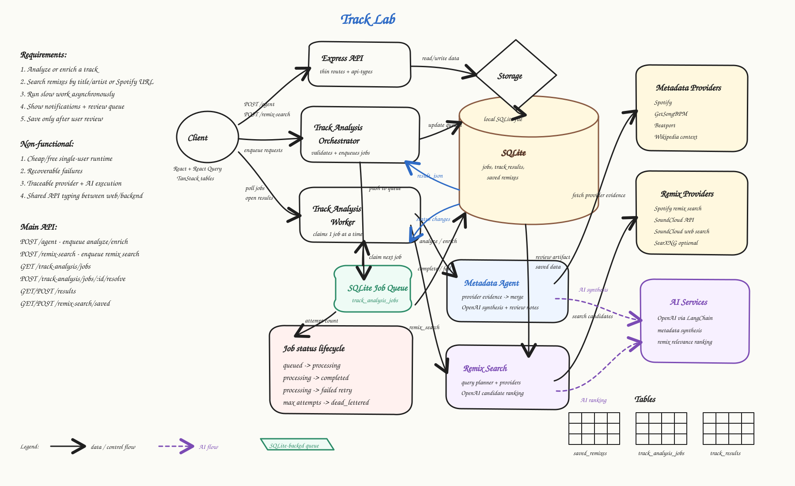
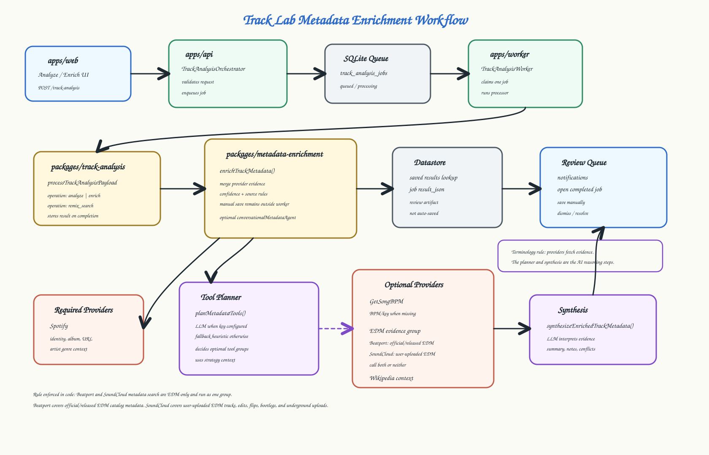

# Track Lab

Track Lab enriches music track metadata with a metadata enrichment pipeline,
stores saved results in a local SQLite database, and reuses saved results before
calling external providers.

## Structure

- `apps/api` - Express API.
- `apps/web` - React/Vite UI.
- `packages/metadata-enrichment` - metadata enrichment strategy, tool planning,
  provider evidence merging, and LLM synthesis.
- `packages/providers` - external data providers. Providers fetch evidence only.
- `packages/remix-search` - Remix discovery providers and ranking.
- `packages/datastore` - SQLite result store.

## Architecture



## Proposed Hybrid Metadata Strategy



## Run

```sh
yarn install
yarn dev
yarn dev:web
```

Useful checks:

```sh
yarn typecheck
yarn workspace @track-lab/web build
```

## Environment

Create `.env` in the repo root.

```sh
OPENAI_API_KEY=
SPOTIFY_CLIENT_ID=
SPOTIFY_CLIENT_SECRET=
GETSONGBPM_API_KEY=
# Optional fallback search service for SoundCloud discovery.
SEARXNG_SEARCH_URL=http://localhost:8080/search
```

Provider credentials are optional for local wiring, but real enrichment quality
depends on them.
Beatport currently uses public web search only and may be blocked by Cloudflare.
SoundCloud remix discovery can use SoundCloud's public search fallback directly.
`SEARXNG_SEARCH_URL` is optional and can provide another free search source.

Run SearXNG locally with Docker:

```sh
docker run --rm -p 8080:8080 searxng/searxng
```

## Persistence

Saved results are stored in:

```sh
data/track-lab.sqlite
```

Override with:

```sh
TRACK_LAB_DB_PATH=/path/to/track-lab.sqlite
```

Saved tracks are unique by returned `Title + Artists`.

## Behavior

- The metadata enrichment pipeline returns `Title`, `Artists`, `Album`, `BPM`, `Genre`, `SubGenre`,
  `Key`, summary, provider status, provider URLs, and errors.
- By default, enrichment checks saved results first.
- The UI can skip saved results to force a fresh enrichment.
- Saved results can be viewed, re-enriched, saved again, or removed.

## Terminology

- Provider: external data fetcher. It does not call LLMs or make product decisions.
- Tool: a provider or operation exposed to an LLM.
- Tool planner: decides which optional tool groups should run from current evidence
  and strategy context.
- Synthesis: LLM step that interprets provider evidence into the final metadata.
- Agent: reserved for the conversational LangChain wrapper that can call tools.
- Worker: background process that claims queued jobs and executes them.

## API

- `POST /track-analysis` - enqueue analyze/enrich metadata work.
- `POST /agent` - legacy alias for enqueueing analyze/enrich metadata work.
- `POST /remix-search` - search remix candidates.
- `GET /results` - list saved results.
- `GET /results/:id` - get one saved result.
- `POST /results` - save an enrichment response.
- `POST /results/:id/enrich` - fresh enrichment for a saved result.
- `DELETE /results/:id` - remove a saved result.

## Notes

The web action icons use inline SVGs from [Heroicons](https://heroicons.com/),
which is MIT licensed.
