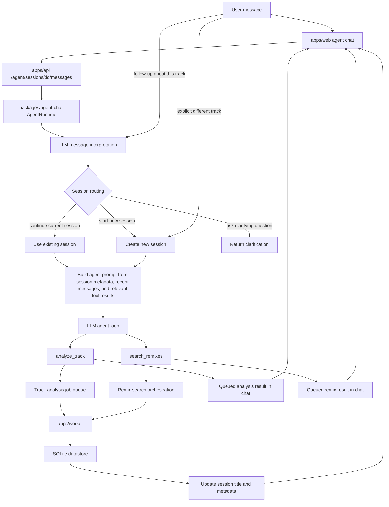

# Track Lab Agent Workflow

This diagram covers the focused music-discovery agent that powers the chat
panel. It interprets each message with the current session context, routes the
message to the right session, and uses only the user-facing tools.

## Notes

- `analyze_track` updates the current focus track and session title after the
  worker result is available.
- `search_remixes` reuses the current focus track for follow-ups such as
  “this track” or “the same song.”
- The agent never exposes provider-specific tools to the user.
- New explicit track analysis starts a new session instead of mixing contexts.
