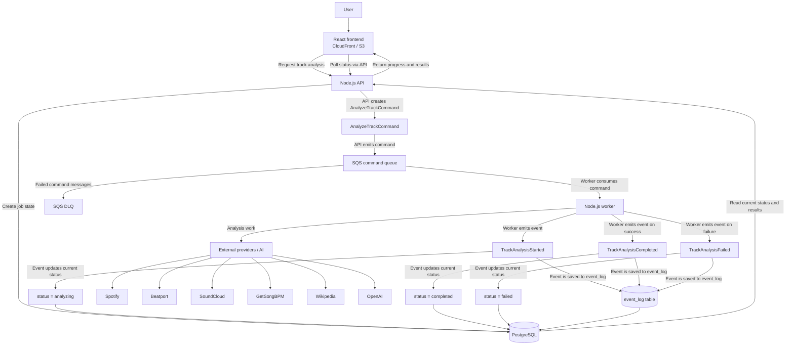

# Track Lab Event-Driven Architecture

Track Lab is already asynchronous, but it is not fully event-driven yet.
Today, the API sends jobs to SQS and the worker consumes those jobs, calls
external providers or AI services, and updates PostgreSQL. The frontend then
reads the latest results from the API.

This document describes the next reasonable architecture step: keep the current
worker-based design, but make the system more event-aware. The goal is better
history, clearer status updates, and a cleaner path for future extension without
introducing Kafka or rewriting the system.

## First Migration Step: Track Analysis

The first production change should cover one flow only: Track Analysis. The API
still returns quickly after enqueueing work, SQS is still the async boundary,
and PostgreSQL remains the source of truth. The difference is that the API now
creates an explicit `AnalyzeTrackCommand`, and the worker records domain events
as it processes that command.

For this first step:

- The API creates an `AnalyzeTrackCommand`.
- The command is sent through the existing SQS command queue.
- The worker consumes the command.
- The worker records `TrackAnalysisStarted` when it claims the job.
- The worker records `TrackAnalysisCompleted` on success.
- The worker records `TrackAnalysisFailed` on failure.
- Events are stored in `event_log`.
- The current job status remains readable through the API.

The frontend should continue polling the API for status. It should not consume
SQS messages or events directly.

## Current Flow

```text
User -> React/Vite frontend -> Node.js API -> PostgreSQL / SQS -> Node.js worker -> external providers / AI -> PostgreSQL -> frontend reads results from API
```

In the current system:

- The API receives a user request from the frontend.
- The API creates or updates job state in PostgreSQL.
- The API sends a job message to SQS.
- The worker consumes the SQS message.
- The worker calls providers such as Spotify, Beatport, SoundCloud,
  GetSongBPM, Wikipedia, and OpenAI.
- The worker writes final results and status back to PostgreSQL.
- The frontend reads results from the API.

That is a good async foundation. The missing piece is a clearer distinction
between commands, which request work, and events, which record what happened.

## Commands vs Events

Commands are requests to do something. They are imperative and are usually
handled by one worker.

Examples:

- `AnalyzeTrackCommand`
- `EnrichTrackMetadataCommand`
- `SearchRemixesCommand`

Events are facts that already happened. They are past-tense records of system
behavior and can be saved, inspected, and eventually consumed by other parts of
the system.

Examples:

- `TrackAnalysisStarted`
- `TrackMetadataEnriched`
- `RemixCandidatesFound`
- `TrackAnalysisCompleted`
- `TrackAnalysisFailed`
- `ReviewNotificationCreated`

The practical rule is:

- Commands flow into the worker.
- Events come out of the worker.

## Before vs After

Before:

```text
Frontend -> API -> SQS Queue -> Worker -> External Providers / AI -> PostgreSQL
```

After:

```text
Frontend -> API -> Command Queue -> Worker -> Domain Events -> event_log / status updates in PostgreSQL -> Frontend reads status via API
```

The important change is not a new queueing platform. It is making the worker
emit explicit domain events when important steps happen, then storing those
events and using them to update current job or track status.

## Proposed Flow



This keeps SQS as the command queue. The worker still owns orchestration. The
frontend still talks only to the API. PostgreSQL remains the source of truth.
Kafka is not added because this step does not need replay, high-volume
streaming, or multiple independent event consumers.

## Phase 1 Event Uses

In Phase 1, events should be used for three practical purposes.

1. Audit/history: understanding what happened in the system, when it happened,
   and which worker or command caused it.
2. Status updates: allowing the frontend to show progress such as started,
   metadata enriched, remix candidates found, completed, or failed.
3. Future extensibility: making it easier later to trigger notifications,
   recommendations, analytics, or AI agents from the same facts.

Phase 1 does not require multiple event consumers, Kafka, or a major platform
change.

## Event Envelope

Every domain event should use a consistent envelope. The envelope should carry
metadata needed for tracing, idempotency, and schema evolution, while `payload`
contains the event-specific data.

```json
{
  "eventId": "uuid",
  "eventType": "TrackAnalysisCompleted",
  "version": 1,
  "occurredAt": "2026-05-24T14:00:00Z",
  "correlationId": "uuid",
  "causationId": "uuid",
  "producer": "apps/worker",
  "idempotencyKey": "track:123:analysis:v1",
  "payload": {
    "trackId": "123",
    "status": "completed"
  }
}
```

Field meanings:

- `eventId`: Unique identifier for this event instance.
- `eventType`: Stable event name, such as `TrackAnalysisCompleted`.
- `version`: Schema version for this event type.
- `occurredAt`: Timestamp for when the fact happened.
- `correlationId`: Identifier that ties together a full user request or job
  flow.
- `causationId`: Identifier of the command, event, or operation that caused
  this event.
- `producer`: Service or package that emitted the event.
- `idempotencyKey`: Stable key used to avoid processing or storing duplicate
  effects.
- `payload`: Event-specific data.

## Phase 1 Implementation Plan

- Keep SQS.
- Keep PostgreSQL as the source of truth.
- Add clear command and event naming.
- Add an `event_log` table.
- Add status tracking based on events.
- Add DLQ documentation.
- Ensure workers are idempotent.

A minimal `event_log` table should capture the event envelope, the event
payload, timestamps, and any useful indexes for `correlationId`, `eventType`,
and track or job identifiers. The current status tables should remain optimized
for API reads; `event_log` should explain how that status was reached.

## Future Phases

### Phase 2

Add SNS or EventBridge only if multiple consumers need to react to the same
event. For example, one consumer might update status, another might create a
notification, and another might feed analytics.

At that point, separate command queues from event topics:

- Command queues deliver work to one responsible handler.
- Event topics publish facts that multiple consumers may observe.

### Phase 3

Consider Kafka, Redpanda, or MSK only if Track Lab needs replay, high-volume
streaming, ordered event processing, long-lived event retention, or advanced
stream processing. Those are real requirements, but they are not Phase 1
requirements.

## What Should Not Change Yet

- Do not replace the API with async-only flows.
- Do not make the frontend consume SQS, Kafka, or events directly.
- Do not introduce Kafka now.
- Do not turn every small action into an event.
- Do not split into microservices prematurely.

The API should remain the frontend boundary. The worker should remain the place
where provider and AI orchestration happens. Events should make the existing
flow easier to understand and extend, not make it more complicated.

## Suggested Future Tickets

- Add event envelope contract.
- Add `event_log` table.
- Add command and event TypeScript types.
- Add `correlationId` support.
- Add idempotency handling in workers.
- Add DLQ documentation.
- Add frontend status polling documentation.
