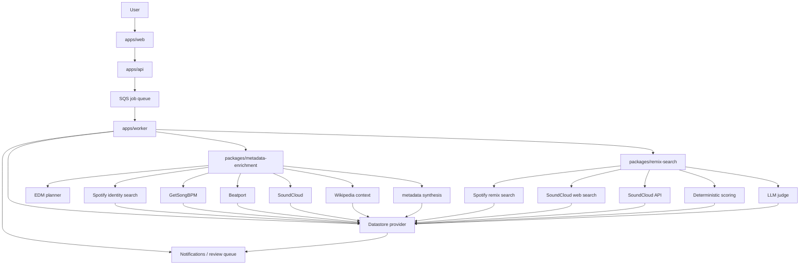
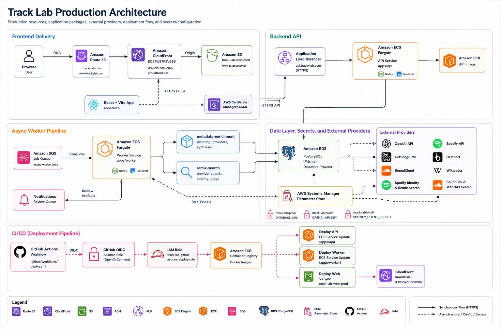

# Track Lab System Architecture

This is the canonical logical architecture diagram in Mermaid form.

## Notes

- The worker/orchestrator owns execution.
- Providers fetch evidence in application code.
- The LLM plans, judges, or synthesizes; it does not autonomously call tools.
- Beatport and SoundCloud are the EDM optional provider group.
- Remix search separates deterministic provider search from LLM judging.
- Prisma/PostgreSQL is the datastore provider.
- Terminology rules are documented in [`ai-terminology.md`](./ai-terminology.md).
- The agent orchestrator flow is documented in [`agent-workflow.md`](./agent-workflow.md).

## Production Architecture

### Request Flow

- Users reach the web app through Route53 records for `https://trackylab.com` and `https://www.trackylab.com`.
- Route53 points traffic to CloudFront distribution `EO27WZ7P2VBSB` (`d3ak515508y96b.cloudfront.net`), with TLS managed by AWS Certificate Manager.
- CloudFront serves the React/Vite build from the S3 bucket `track-lab-web-prod`.
- The browser calls `https://api.trackylab.com`, which routes through an Application Load Balancer to the ECS Fargate API service running `apps/api`.
- The API uses Prisma through the datastore provider to read and write PostgreSQL data in Amazon RDS. The API health check endpoint is `GET /health`.

### Async Job Flow

- The API writes track-analysis job state to PostgreSQL and enqueues async work in Amazon SQS.
- The ECS Fargate worker service running `apps/worker` consumes SQS messages.
- The worker orchestrates `packages/metadata-enrichment` and `packages/remix-search`, then writes results and review-queue notifications back through Prisma/PostgreSQL.
- Metadata enrichment uses Spotify identity search, GetSongBPM, the EDM planner, Beatport, SoundCloud, Wikipedia context, OpenAI-backed synthesis, and deterministic application logic.
- Remix search uses Spotify remix search, SoundCloud web/API search, deterministic scoring, and the LLM judge.

### Deployment Flow

- GitHub Actions authenticates to AWS using GitHub OIDC and the IAM role `track-lab-github-actions-deploy-role`.
- The deployment workflow builds API and worker Docker images, pushes them to Amazon ECR, and updates the ECS Fargate API and worker services.
- The workflow builds the Vite frontend with `VITE_API_BASE_URL=https://api.trackylab.com`, uploads `apps/web/dist` to `s3://track-lab-web-prod`, and invalidates CloudFront distribution `EO27WZ7P2VBSB`.

### Secrets And Configuration

- ECS tasks read production secrets from AWS SSM Parameter Store.
- Existing production parameters:
  - `/track-lab/prod/DATABASE_URL`
  - `/track-lab/prod/OPENAI_API_KEY`
  - `/track-lab/prod/SPOTIFY_CLIENT_SECRET`

### Assumptions

- The Application Load Balancer and ECS service names are intentionally shown by role because only the production API domain and application service names are documented here.
- ECR repository names are shown by function because this document tracks the architecture rather than deployment repository configuration.
