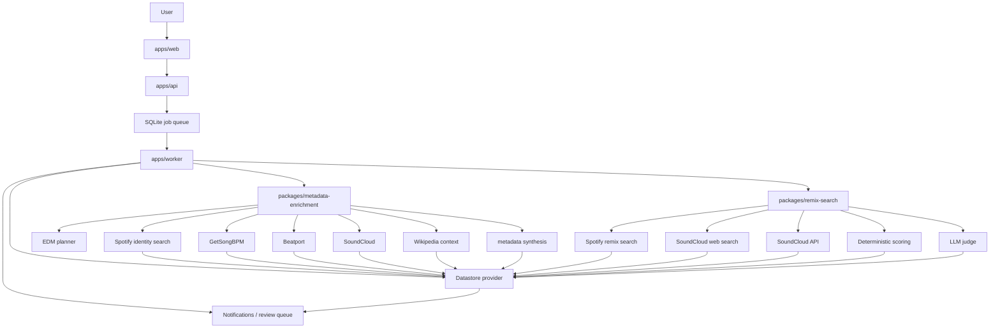

# Track Lab System Architecture

This is the canonical architecture diagram in Mermaid form.

## Notes

- The worker/orchestrator owns execution.
- Providers fetch evidence in application code.
- The LLM plans, judges, or synthesizes; it does not autonomously call tools.
- Beatport and SoundCloud are the EDM optional provider group.
- Remix search separates deterministic provider search from LLM judging.
- The datastore provider defaults to SQLite and can switch to Prisma/PostgreSQL for the datastore tables that have Prisma support.
- Terminology rules are documented in [`ai-terminology.md`](./ai-terminology.md).
- The agent orchestrator flow is documented in [`agent-workflow.md`](./agent-workflow.md).
