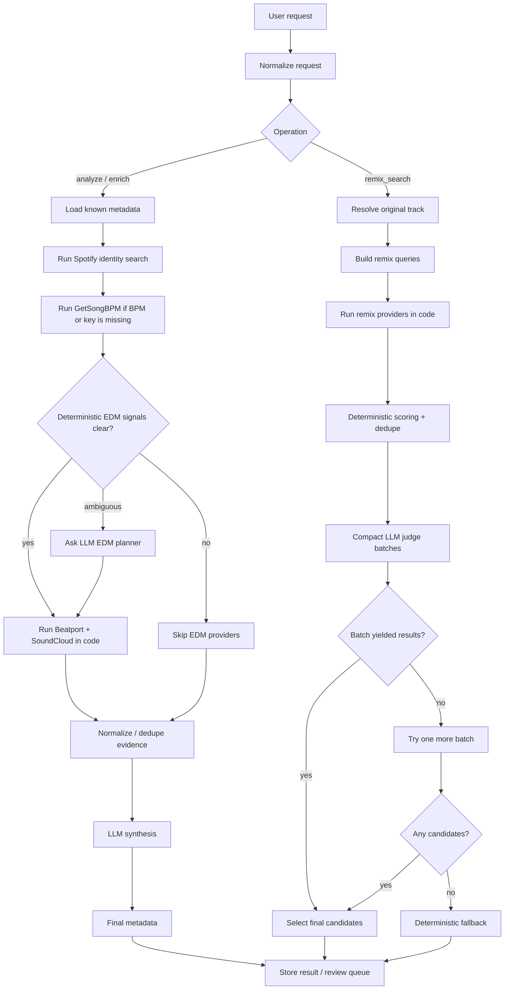

# Track Lab Pipeline Workflow

This is the lightweight Markdown workflow companion to the pipeline strategy
doc. It intentionally replaces the older SVG strategy diagrams.

## Notes

- The worker/orchestrator owns execution.
- Providers execute in application code.
- The LLM only plans, judges, or synthesizes.
- Beatport and SoundCloud run as one EDM provider group.
- Search and judging are separate phases for remix search.
